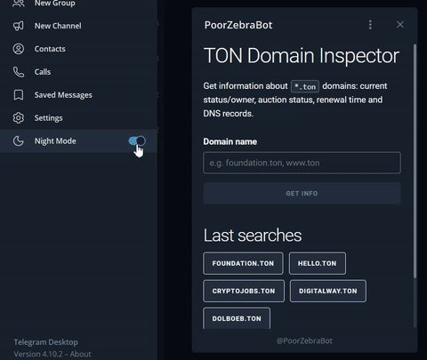

# TON Domain Inspector

[Mini App](https://core.telegram.org/bots/webapps) created for Telegram Mini App Contest in October 2023.

Demo link: https://t.me/PoorZebraBot/tmac2023 (not guaranteed to work beyond November 2023).

## Repo structure

  * /docs - published output static files for MiniApp, which are handled by GitHub Pages and used as app source in BotFather (so, no separate hosting needed).
  * /server - server-side part, written in C# ([.NET 6.0](https://dotnet.microsoft.com/en-us/)), that provides data for Mini App. You'll need to publish running app via [Ngrok](https://ngrok.com/) or use publish to hosting provider (Windows or Linux).
  * /webapp - Mini App (client), written using [Svelte Kit](https://kit.svelte.dev/) to minimize runtime app size.

## App architecture

1. Mini App provides input field where user should type [TON Domain name](https://dns.ton.org/) he wants to get info about (domain may be entered with or without `.ton` suffix). 
2. Submitted domain name is sent to server app, which connects to TON Blockchain, extracts information about requested name and returns JSON in response.
3. Client app displays domain name info in structured way.
4. Last 5 checked domain names are stored in [Telegram Cloud Storage](https://core.telegram.org/bots/webapps#cloudstorage) (new in v6.9) so user can access them from any device after reopening app.
5. Also, Telegram theme colors are used (via CSS variables), so Mini App changes own look on-the-fly.

Please consult commit history to get step-by-step guide how to create Mini App from scratch (empty project, static pages, scripting) using Svelte Kit.

For server-side app, you may use any language and SDK, check [docs.ton.org](https://docs.ton.org/develop/dapps/apis/sdk).

## Build and run

### Server side

1. Install [.NET SDK 6.0](https://dotnet.microsoft.com/en-us/download/dotnet/6.0) or later (Windows, Linux, macOS compatible) 
2. Obtain latest TON Blockchain binaries (tonlibjson.*) and drop them into your source code /server folder (consult [TonLib.NET readme](https://github.com/justdmitry/TonLib.NET#installing-dependencies-and-running-a-demo) for details).
3. Run `dotnet run` from console (in /server folder)
4. Open http://localhost:5000/search?domain=foundation.ton in your browser.  
   First request will wait for about 1 minute and may even fail, because tonlib need some time to sync with TON Blockchain (you'll see progress in console logs), but this is not a problem, just refresh (F5) your page to retry. Once synced, response with JSON data will arrive in less than a second.
5. Use [Ngrok](https://ngrok.com/) to publish your port 5000 to internet:    
    `ngrok http 5000`    
    Now you have url like `https://0893-95-24-75-242.ngrok-free.app` and your server-side app is accessible from internet.

### Client app

1. Install [npm](https://www.npmjs.com/) if needed :)
2. Navigate to /webapp and run `npm install` from there
3. Edit `.env` file and change hostname to your one from ngrok, so your file should look like:  
    `PUBLIC_SERVER="https://0893-95-24-75-242.ngrok-free.app/search"`  
    (don't remove `/search` at end of address!)
4. Run `npm run dev` to run app on your computer
5. Again, use Ngrok to publish your port 5173 to internet (`ngrok http 5173`).    
   Ngrok may say that your account is limited to only 1 session and you need to perform some actions to be able to run multiple sessions - follow its instructions or just pass to next step (to publish to CDN).
6. Publish app to some CDN (static file hosting):
   1. Run `npm run build` to update files in `./../docs` folder 
   2. Upload this file to static hosting of your choice (this repo uses GitHub Pages, don't forget `CNAME` and `.nojekyll` files if you want to use GH Pages too!).
7. Finally, you should have some public address (like https://tondomaininspectorbot.just-dmitry.ru/) which opens your index page.

### Bot Father

Go to https://t.me/BotFather and create new Mini App (it will also ask you to create new Bot if you don't have any).
   * Fill name, title, description and other fields with value of your choice;
   * Use address from step 7 (URL of your mini app), e.g. https://tondomaininspectorbot.just-dmitry.ru/, when BotFather ask for WebApp URL.
   * Finally, BotFather will provide you with your app address like `https://t.me/<yourbotname>/<yourbappname>`
   
If you made everything correctly, then you should be able to open your Mini App.

